# Ray Tracing

## CUDA Realtime Smoke

Configure with the clang + vcpkg toolchain setup from `.vscode/settings.json`, then build and run:

```bash
VCPKG_ROOT=$HOME/vcpkg_root cmake -S . -B build-clang-vcpkg-settings \
  -DCMAKE_TOOLCHAIN_FILE=$HOME/vcpkg_root/scripts/buildsystems/vcpkg.cmake \
  -DCMAKE_C_COMPILER=clang \
  -DCMAKE_CXX_COMPILER=clang++ \
  -DCMAKE_CUDA_COMPILER=/usr/local/cuda-13.0/bin/nvcc \
  -DCMAKE_CUDA_HOST_COMPILER=clang++ \
  -DCMAKE_CUDA_ARCHITECTURES=86
cmake --build build-clang-vcpkg-settings --target render_realtime -j
./bin/render_realtime --camera-count 4 --frames 2 --profile realtime --output-dir build/realtime-smoke
```

The CLI writes one PNG per frame and per active camera under `build/realtime-smoke/` and prints per-frame timing plus an aggregate FPS summary.

| Quads            | Earch Sphere            | Checkered Spheres            |
| ---------------- | ----------------------- | ---------------------------- |
| 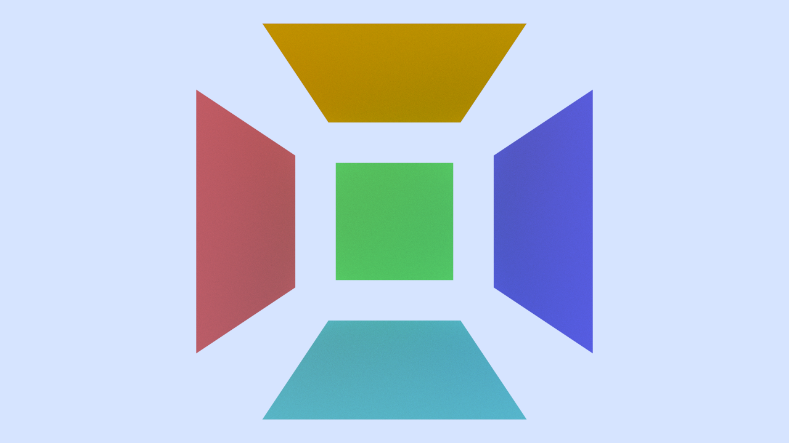 | 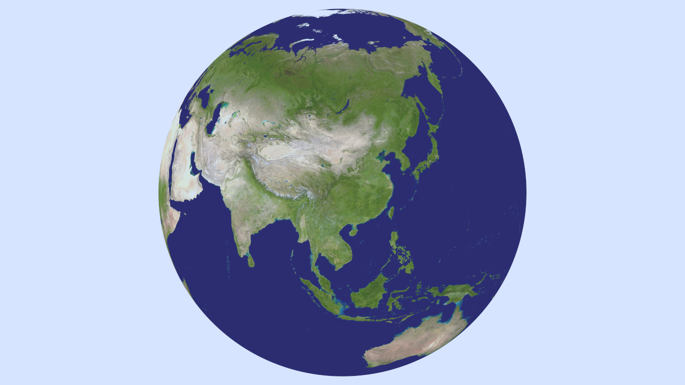 | 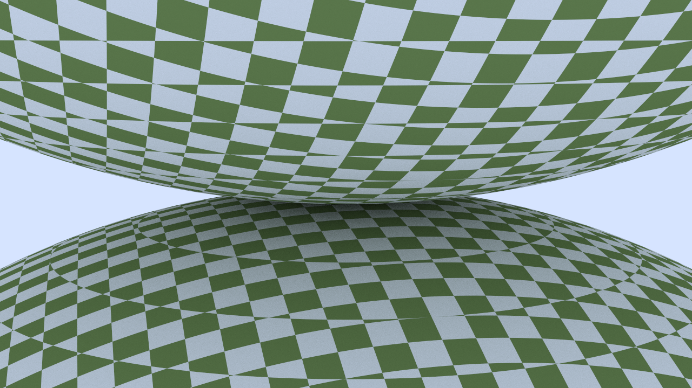 |

| Perlin Spheres            | Simple Light            | Bouncing Spheres            |
| ------------------------- | ----------------------- | --------------------------- |
| 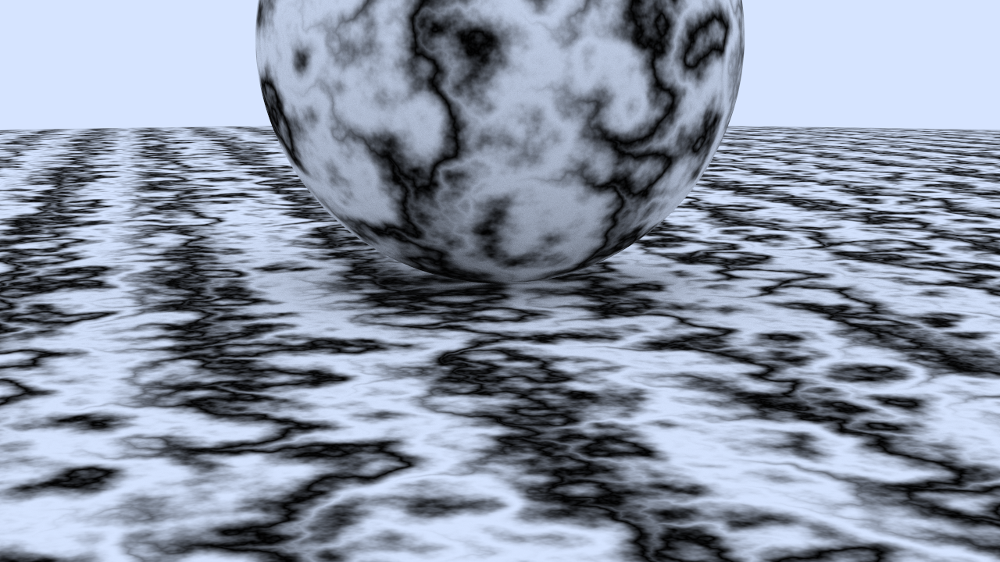 | 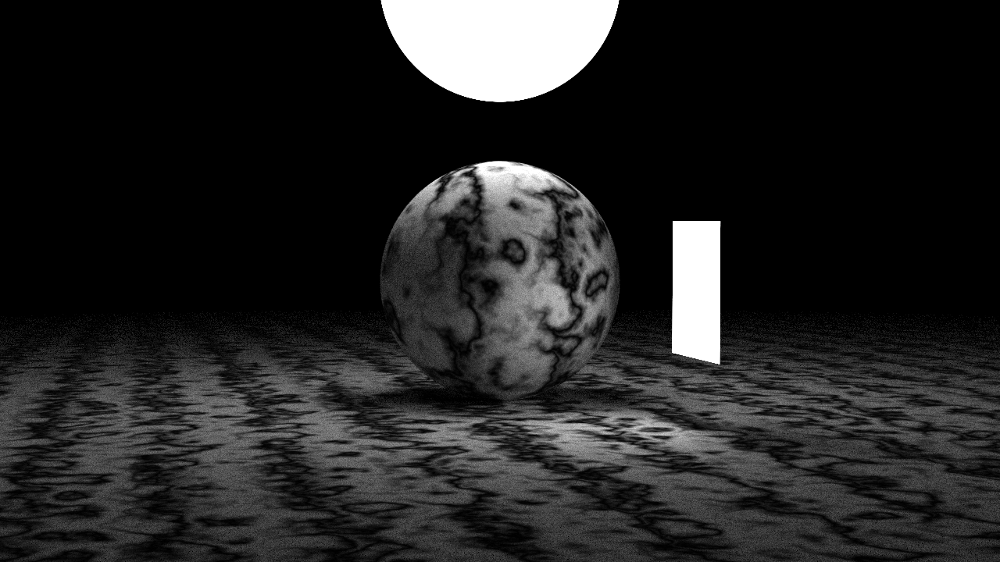 | 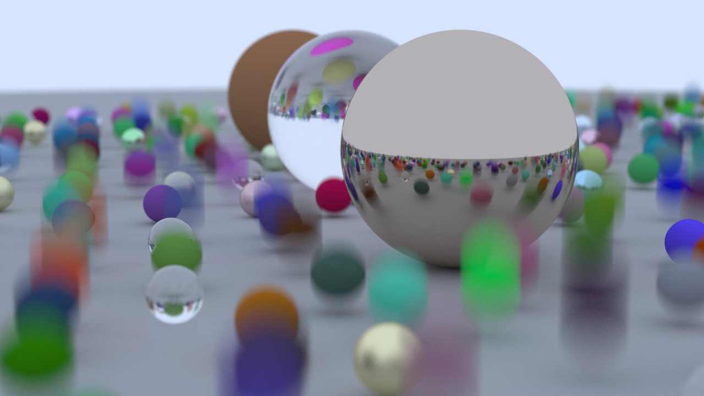 |

| Cornell Smoke            | Cornell Smoke Extreme            |
| ------------------------ | -------------------------------- |
| 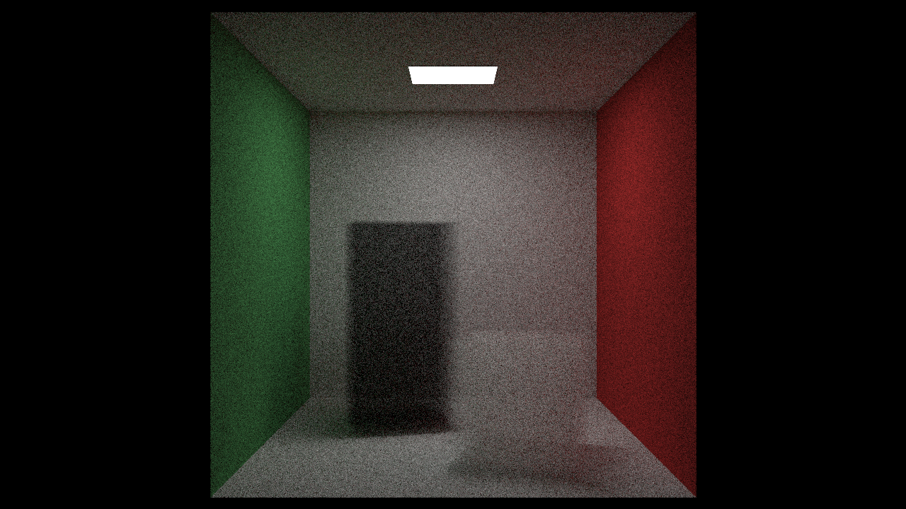 | 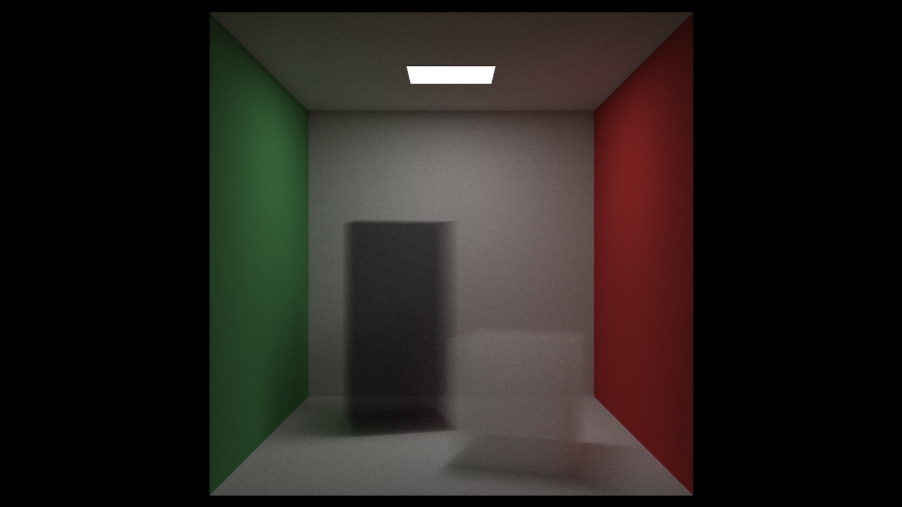 |

| Cornell Box            | Cornell Box Extreme            |
| ---------------------- | ------------------------------ |
| 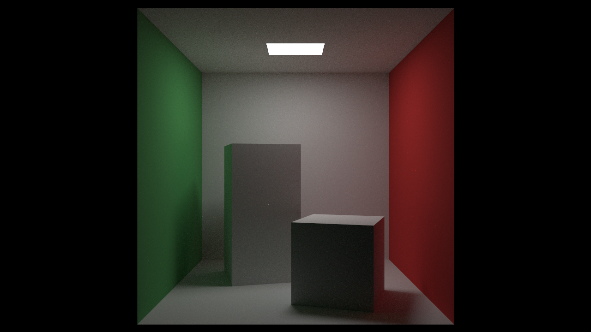 |  |

| Ray Tracing The Next Week Final Scene | Ray Tracing The Next Week Final Scene Extreme |
| ------------------------------------- | --------------------------------------------- |
| 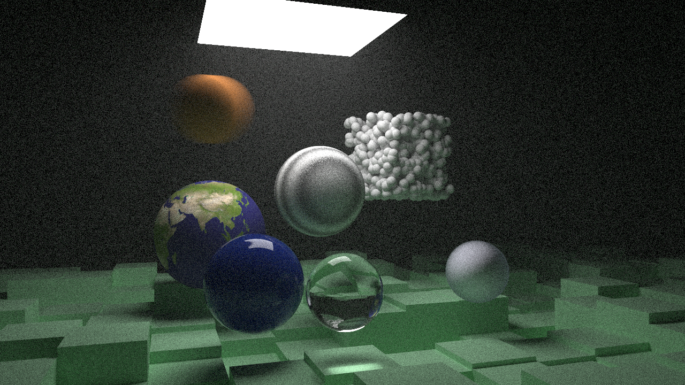          | 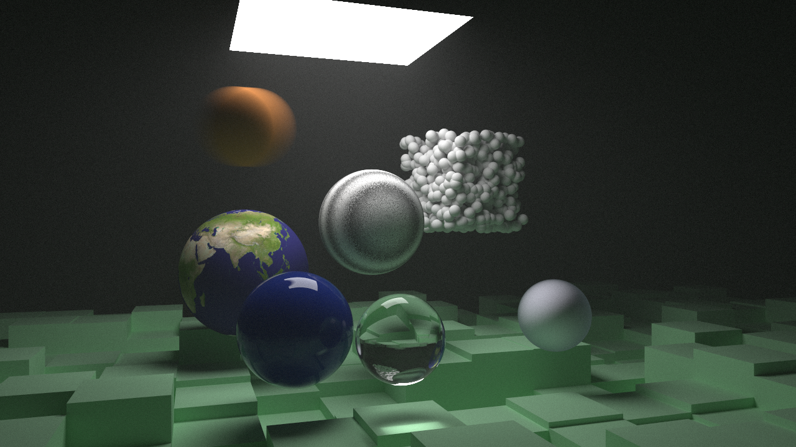          |
